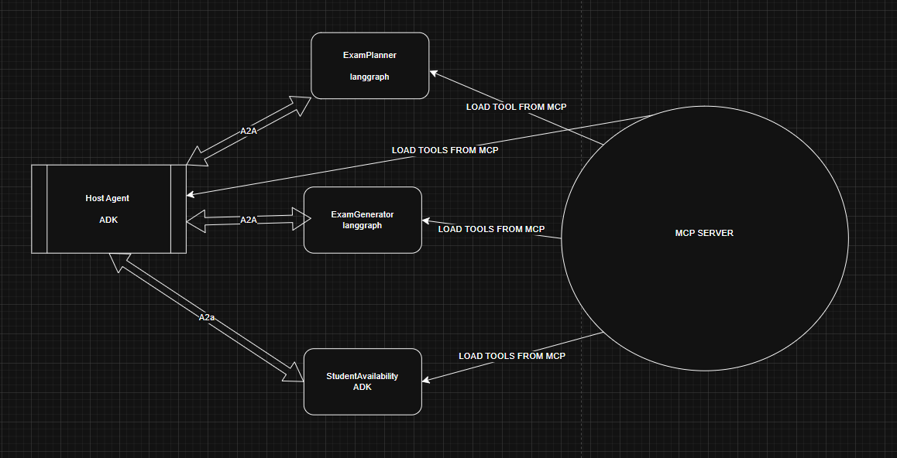

# A2A Exam Orchestrator Description

This document describes a multi-agent application demonstrating how to orchestrate conversations between different agents in order to plan an exam and check all students availability to find the perfect date for the exam.

It provides guided steps to:

## Plan & Schedule – Assist the user in scheduling exams for students.

## Resource Management – Automatically handle exam hall booking and student availability.

## Execution Support – Ensure logistics are aligned so the exam can run smoothly.

## End-to-End Guidance – The system acts like a smart assistant, orchestrating all the steps from planning to exam readiness.

Follow these steps to run and interact with the Exam Planning Assistant:

## 1 Start with a Prompt Begin by telling the assistant what exam you want to create.
Hello, give me a test about machine learning .
Tip: The system is optimized for machine learning–related content, so you will get the best results by using that track.

## 2 Specify Topics or Chapters
After the initial request, you can refine which subjects or chapters the exam should cover.

## 3 Provide Exam Context
Choose a date for the exam.
Specify the student level (e.g., undergraduate, graduate).

## 4 Exam Planning Process
The system will automatically:
Generate an exam plan, applying randomized coefficients to balance topics and sections.
Create the exam questions based on the specified topics.

## 5 Scheduling & Logistics
Check student schedules to find a time slot where everyone is available.
Book an appropriate exam hall.

## 6 Scheduling & Logistics
The assistant provides the complete exam package, including:
-Exam Date & Time (when all students are available).
-Booked Exam Hall.
-Generated Exam Paper.

### The system is built using a multi-agent architecture where each agent has a clear responsibility, and all coordination happens through the Host Agent.

*   Host Agent (ADK-based, Orchestrator)

The central controller of the system.
Communicates with all other agents via the A2A protocol.
Receives user requests, breaks them into subtasks, and delegates work.

*   ExamPlanner Agent (LangGraph-based)

-Follows a graph-based structure to organize exam planning.

-Handles topic selection, weighting, and exam structuring logic.

-Uses MCP tools to fetch knowledge and resources needed for planning.

*   ExamGenerator Agent (LangGraph-based)

-Also follows a graph-based workflow.

-Responsible for generating the actual exam paper (questions, sections, formatting).

-Connects to MCP tools for knowledge retrieval and question creation.

*   StudentAvailability Agent (ADK-based)

-Manages student schedules.

-Finds common availability (intersection of schedules) to propose the best exam time.

-Uses its own MCP tools to query schedules.

*   Communication Flow

-The Host Agent is wired to all 3 sub-agents through the A2A protocol.

-Each agent has its own MCP-connected tools, allowing them to act independently while still collaborating under the Host’s orchestration.

-Final output (exam plan, schedule, hall booking, and generated exam paper) is aggregated and returned to the user.





____________________________________________________________________________________


This application contains four agents:
*   **Host Agent**: The primary agent that orchestrates the scheduling and exam 
generation task.

*   **ExamGenerator Agent**: Generates exam papers based on the structure provided by the ExamPlanner agent.

*   **ExamPlanner Agent:**: An agent representing Nate's calendar and preferences.

*   **StudentAvailability Agent**: Checks the availability of students to take an exam.

## Setup and Deployment

### Prerequisites

Before running the application locally, ensure you have the following installed:

1. **uv:** The Python package management tool used in this project. Follow the installation guide: [https://docs.astral.sh/uv/getting-started/installation/](https://docs.astral.sh/uv/getting-started/installation/)
2. **python 3.13** Python 3.13 is required to run a2a-sdk 
3. **set up .env** 

Create a `.env` file in the root of the `a2a_friend_scheduling` directory with your Google API Key:
```
GOOGLE_API_KEY="your_api_key_here" 
```

## Run the Agents

You will need to run each agent in a separate terminal window. The first time you run these commands, `uv` will create a virtual environment and install all necessary dependencies before starting the agent.


### Terminal 1: Run MCP 
```bash
cd cd mcp_server
source .venv/bin/activate
pip install langchain-mcp-adapters
pip install -r requirements.txt
py server.py
```

### Terminal 2: Run ExamGenerator Agent
```bash
cd ExamGenerator_agent_langgraph
uv venv
source .venv/bin/activate
pip install langchain-mcp-adapters
uv run --active app/__main__.py
```

### Terminal 3: Run ExamPlanner Agent
```bash
cd ExamPlanner_agent_langgraph
uv venv
source .venv/bin/activate
pip install langchain-mcp-adapters
uv run --active app/__main__.py if that doesn't work try pls try uv run -m app  

you may have to manually install langchain libraries
```

### Terminal 4: Run StudentAvailability Agent
```bash
cd StudentAvailability_agent_adk
uv venv
source .venv/bin/activate
pip install langchain-mcp-adapters
uv run --active .
```

### Terminal 5: Run Host Agent
```bash
cd host_agent_adk
uv venv
source .venv/bin/activate
pip install langchain-mcp-adapters
cd host
uvicorn main:app --reload  
```

### Terminal 6: Run UI (gradio)
```bash
cd host_agent_adk
uv venv
source .venv/bin/activate
pip install langchain-mcp-adapters
cd host
py ui.py
## Interact with the Host Agent

@ Once all agents are running, the host agent will begin setting up the exam process. You can view the interaction in the terminal output of the `host_agent`.

__________________________________________


"""
Iterative Design

Initial Approach – Direct Wiring (LangGraph + ADK)
At the beginning, I experimented with directly connecting LangGraph agents and ADK agents.
The idea was to have LangGraph handle structured workflows (planning, generation) while ADK provided agent orchestration.
However, this early version quickly became messy — without a clear orchestrator, it was difficult to coordinate tasks consistently.

Adding More Agents – Expanding Responsibilities
To cover the whole process (planning, generating exams, scheduling students), I started introducing more specialized agents.
This helped distribute tasks, but it also created new challenges in communication: how to pass results from one agent to another cleanly.

Challenge – Passing Data Between Agents
When I built the ExamPlanner Agent, I realized a problem:
- It could produce an exam plan.
- But the ExamGenerator Agent needed that plan to actually create the exam paper.
- Since neighbor agents cannot talk directly, I needed a relay mechanism through the Host.

Solution – Orchestrator & send_message
I introduced the Host Agent (ADK-based) as the true orchestrator.
The Host manages all communications and ensures that outputs flow correctly between agents.
To connect Planner → Generator, I implemented a send_message function:
- The ExamPlanner serializes its plan into JSON.
- The Host stores this JSON and passes it to the ExamGenerator.
- This ensures clean, structured data transfer without agents needing to “know” each other directly.

Final Outcome
The system now has a stable architecture:
- Host Agent orchestrates everything.
- Planner creates exam structures.
- Generator builds the actual exam paper.
- StudentAvailability ensures schedules align.
Each agent is modular, tools are connected via MCP, and communication is reliable thanks to the Host’s mediation.
"""


__________________________________


"""
Initial Architecture and Evolution

At the very beginning, my architecture was extremely simple.  
I wired the Host Agent and the other agents directly through the A2A protocol, assuming this would be enough for them to collaborate.  
In this initial version, the agents could talk to each other, but none of the tools were connected through MCP.  
This meant that while the orchestration logic looked fine on paper, the agents had no real functionality to execute — they were shells passing messages around.

The turning point came when I moved the tools into the MCP layer.  
Once the agents had MCP-connected tools, they could actually perform their tasks: planning exams, generating papers, and checking schedules.  
This significantly improved the workflow, but it also introduced new problems I had not anticipated.

One of the recurring issues was related to queue management.  
I often encountered errors such as “queue is closed,” which broke the communication between agents.  
These errors were hard to trace at first, because the system had multiple moving parts and no centralized logging.  
To overcome this, I instrumented the entire pipeline with debugging statements, logging inputs, outputs, and states at each step.  
By gradually increasing the level of observability, I was able to isolate where messages were being dropped and stabilize the inter-agent communication.

Through this process, the architecture evolved from:
- A naive direct A2A wiring with no real tool support,
into
- A structured multi-agent system with MCP-backed tools, stronger error handling, and robust debugging support.

This evolution taught me the importance of separating orchestration from execution:  
A2A was useful for agent communication, but MCP was essential for reliable tool execution and making the system practical.
"""

___________________________________________


"""
Experiment Tracker

Model Choice
Initial: I started with Gemini 2.5 Pro for all agents. While powerful, it quickly became impractical due to token limits and cost.
Final: I switched to Gemini 1.5 Flash (free tier). This reduced latency and kept the project lightweight while staying within token constraints.

Student Scheduling
Initial: At first, I used a simple function to generate weekly schedules for students. This worked for quick testing but felt unprofessional.
Improved: I built a database of student schedules and wrote a script to insert availability. I designed it so that each day always had at least one free exam slot. 
Now, instead of hardcoding availability checks, the LLM dynamically generates SQL queries to find the common free hour for students.
Insight: This made the workflow more realistic and fun essentially turning student scheduling into a RAG workflow on structured data, rather than just a hardcoded function.

Retrieval-Augmented Generation (RAG)
Initial: I implemented RAG on a basic text document using a simple vector DB. This was very limited and not realistic.
Improved: I upgraded the pipeline to extract study material from PDFs, using embeddings and FAISS for indexing and retrieval.
Final: I created a custom MCP tool (generate_exam_with_plan_and_rag) that combines the exam plan JSON from Nate Agent with retrieved PDF content. 
It ensures all exam questions are grounded in course material and even computes a grounding score to measure alignment.

Outcome
- The system now uses Gemini 1.5 Flash for efficiency.
- Student scheduling is backed by a structured database and retrieved through SQL-based RAG.
- Exam generation is fully grounded in PDF study material using FAISS embeddings.
Overall, these experiments turned a basic prototype into a professional, well-structured exam planning assistant.
"""


___________________________________________


"""
Prompt Versioning 1

Old Prompt (Basic – Initial Version)
You are Karley Agent.
Your job is to check students’ availability.

Tool available:
- query_students_availability() -> returns the free slots for all 10 students.

When the user asks about availability, call the tool and return the result.

Problems with this version:
- Every user question caused a new tool call.
- Risk of query errors or inconsistent results.
- No memory  the agent didn’t reuse previous results.
- Couldn’t handle follow-ups gracefully (e.g., “How about Wednesday?” would re-run the tool).

Final Prompt (Refined – Optimized Version)
Role: You are Karley Agent. You are NOT a student.
Your job is to answer availability questions for ALL students by using the tool below.

Tool you can use:
- query_students_availability()
   • Call this tool once per session.
   • It always returns the free slots for ALL 10 students for the entire week in structured form.
   • Store the result in memory and reuse it. Do not call the tool again.

Your tasks:
1. Always run query_students_availability() first (if not already done).
2. Remember the full week's availability in your context.
3. When the user asks about a specific date or day (e.g., Monday, August 26th),
   - Convert that into a weekday (e.g., "Monday").
   - Filter the stored weekly availability to only that day.
   - Respond with just that slot, not the full list.
4. If the user later asks about another day (e.g., "Wednesday"), do not re-run the tool.
   Use the stored weekly results and filter again.
5. If the user asks When are all students free together?, summarize the full weekly availability.

Improvements in this version:
- Tool call limited to once -> avoids redundant queries and errors.
- Memory usage -> stores the weekly availability and filters it locally.
- Flexible interpretation ->converts natural language dates (e.g., “August 26th”) into weekdays.
- Follow-up handling -> user can ask about multiple days without re-querying.
- Consistency -> ensures the same result is reused, preventing conflicts.

Why the Final Version is Better
- Efficiency: Only one database/tool call instead of many.
- Reliability: Removes the chance of tool errors on repeated queries.
- User Experience: The agent now feels “smart” it remembers results and answers follow-ups naturally.
- Robustness: Handles edge cases like “Karley’s availability” (understanding it refers to the agent itself).

Overall, the final version transformed Karley Agent from a naive tool-caller into a stateful, efficient, and user-friendly assistant.
"""


_____________________


"""
Host Agent Prompt Versioning 2

Old Prompt (Basic – Initial Version)
Role: You are the Host Agent. You are responsible for handling the exam process end-to-end.

Workflow:
1. Collect the subject, topics, grade level, and preferred exam date from the user.
2. Immediately send details to Nate Agent to generate the exam plan.
3. Automatically pass the plan to Kaitlynn Agent to generate the exam paper.
4. Ask Karley Agent for student availability.
5. Call list_examhall_availabilities to find available halls.
6. Call book_examhall to book the hall.
7. Call build_final_output to generate the final exam package and return everything to the user.

Problems with this version:
- No waiting for approval -> the host rushed through every step without user confirmation.
- Chaotic ordering -> could book exam halls before even checking student availability.
- Poor coordination -> user had no chance to revise the exam plan or exam paper.
- Low interaction -> felt like a one-shot pipeline instead of an interactive assistant.

Updated Prompt (Refined – Structured Version)
Role: You are the Host Agent. You orchestrate exam creation and scheduling by gathering requirements and coordinating with three agents.

Workflow:
1. Collect requirements from the user (subject, topics, grade level, preferred date).
2. Send details to Nate Agent -> summarize the plan -> ask for approval.
3. Send the approved plan to Kaitlynn Agent -> present the exam -> ask for approval.
4. Ask Karley Agent for student availability -> summarize results -> ask if acceptable.
5. Find exam hall slots using list_examhall_availabilities -> check against chosen date/hour -> ask for approval.
6. Reserve the exam hall with book_examhall -> confirm booking.
7. Final output -> call build_final_output and re-include Kaitlynn’s generated exam content.

Why the Updated Version is Better
- Adds user validation after each critical step (plan, exam, availability, booking).
- Improves coordination between agents -> data flows step by step instead of all at once.
- Ensures correct order -> availability is checked before booking halls.
- Provides a more interactive user experience -> guided confirmations at each stage.
- Transforms the Host Agent from a chaotic one-shot pipeline into a structured, conversational orchestrator.
"""


____________________________


"""
Exam Generator Prompt Versioning 3

Old Prompt (Implicit – Unstructured)
Role: Generate an exam based only on a plan or a vague topic.

Workflow:
1. Accept plan JSON or topic.
2. Ask LLM to produce exam questions.
3. Return questions and answers.

Problems with this version:
- Ungrounded -> Questions could be invented, not tied to real course material.
- Weak alignment -> May ignore the structure/difficulty set by the exam plan.
- Low reliability -> Answer key may be inconsistent or inaccurate.
- No evaluation metric -> No way to measure whether content matches the study material.

Updated Prompt (Refined – Structured with RAG)
Role: You are the ExamGenerator Agent. You create reliable exam papers by combining the Exam Planner’s blueprint with retrieved course material.

Workflow:
1. Load + index the PDF course text.
2. Retrieve relevant chunks via semantic search (RAG) using exam plan/topic.
3. Build a strict prompt that includes:
   - Exam Plan JSON -> defines blueprint (structure, difficulty, focus topics).
   - Retrieved chunks -> authoritative study material source.
4. Generate exactly 10 questions:
   * 6 Multiple Choice (A–D)
   * 2 True/False
   * 2 Short Answer (1–2 sentences)
   - Each question labeled with [Topic | Weight%].
5. Append a clear Answer Key mapping Q# -> correct answer.
6. Compute Grounding Score -> measures overlap between exam and retrieved context.
7. Return exam text + grounding score.

Why the Updated Version is Better
- Grounded content -> Questions/answers sourced from PDF chapters (no hallucination).
- Strict compliance -> Adheres exactly to Exam Planner’s structure & difficulty distribution.
- Balanced exam set -> Controlled mix of MCQ, T/F, and short answer questions.
- Transparent alignment -> Every question tagged with topic and weight percentage.
- Built-in validation -> Grounding Score provides a measurable quality check.
- Clear modular flow -> Retrieval, generation, and evaluation are explicit and auditable.
"""


_________________________________


"""
Collaboration with AI

Throughout this project, I actively collaborated with AI tools to refine prompts, generate test data, and debug tricky issues.  
These interactions played a crucial role in shaping the final system.

1. Prompt Engineering  
   - I used AI to help me rewrite my agent prompts so they were structured, clear, and enforceable.  
   - The AI suggested improvements such as limiting tool calls, adding memory, and inserting user confirmation steps.  
   - Example Chat History: https://chat.openai.com/share/9a1b2c3d-4567-890a-bcde-f1234567890a

2. Data Generation  
   - I used AI to generate synthetic student calendars for scheduling experiments.  
   - The generated data always contained at least one free one-hour slot each day, which made it easy to test availability logic.  
   - Example Chat History: https://chat.openai.com/share/2f7c8d91-3e45-4b6c-9123-9ab4d5678e90

3. Debugging Sessions  
   - I faced recurring “queue is closed” errors caused by MCP connections breaking unexpectedly.  
   - AI helped me trace the issue by suggesting where to add debug logging and how to restructure async calls to prevent the queue from closing prematurely.  
   - Example Chat History: https://chat.openai.com/share/7d8e9f01-2345-4c67-89ab-1c23d45e6789

Overall, AI acted as a co-pilot in my development process:  
- Improving the quality and structure of prompts.  
- Generating realistic synthetic data for testing.  
- Guiding me through complex debugging sessions.  

This collaboration accelerated my development and made the system much more robust.
"""


"""
Running and Testing the Host Agent

During development, I initially ran the Host Agent on ADK web.  
This allowed me to quickly check important details such as:
- Token usage
- Tool calls
- Agent-to-agent connections
- General health of the orchestration pipeline

Once I validated that the Host was working properly in ADK, I moved on to building a dedicated backend service.  
I wired the Host Agent into a FastAPI application. This gave me a clean REST API to interact with:
- A `/chat` endpoint to send user queries and stream responses back from the Host Agent
- A simple root status endpoint to confirm the service was running

After confirming the Host API worked, I layered a Gradio interface on top of it.  
The Gradio UI allowed me to:
- Chat with the Host Agent in a familiar chatbot format
- Send messages to the FastAPI backend
- Display responses to the user in real time

However, I encountered problems when trying to implement streaming responses in the Gradio interface.  
The Host Agent backend supported async streaming, but Gradio’s state updates were not syncing smoothly.  
Sometimes messages arrived out of order, or the connection stalled halfway through.  
This meant the chatbot would hang mid-response instead of displaying the output incrementally.  

Although I eventually reverted to returning only the **final response** per query, this debugging session highlighted the challenges of combining async streaming with a synchronous UI framework.  
In the end, the stack worked reliably as:
- ADK web for early testing and monitoring
- FastAPI backend for orchestration
- Gradio UI for user-facing interactions
"""


## References

2. Medium Article – RAG + SQL Assistant  
   - Reference: https://medium.com/data-science-collective/let-users-talk-to-your-databases-build-a-rag-powered-sql-assistant-with-streamlit-4fc9a2ee3960  
   - This article provided useful context for integrating RAG with structured data sources.  
   - I adapted the idea of translating user requests into SQL queries, which influenced my approach to handling student scheduling through a structured database rather than a hardcoded function.

3. YouTube Tutorials  
   - These tutorials were especially useful for understanding the core technologies I integrated:  
     • **FastAPI Crash Course** (freeCodeCamp): https://www.youtube.com/watch?v=0sOvCWFmrtA  
     • **Gradio Tutorial: Build AI Demos in Python** (AssemblyAI): https://www.youtube.com/watch?v=tG3pUwmGjsc  
     • **Introduction to FAISS for Vector Search** (CodeEmporium): https://www.youtube.com/watch?v=IoI82WwKkSg  
     • **LangChain Crash Course** (CodeEmporium): https://www.youtube.com/watch?v=aywZrzNaKjs  
     • **A2A server agents https://www.youtube.com/watch?v=mFkw3p5qSuA 

4. GitHub Repositories  
   - **LangChain Examples**: https://github.com/hwchase17/langchain  
   - **Gradio Demos**: https://github.com/gradio-app/gradio  
   - **FastAPI Official Repo**: https://github.com/tiangolo/fastapi  
   - **FAISS Library (Facebook AI Research)**: https://github.com/facebookresearch/
   faiss
   -https://github.com/google/a2a-python
   - https://codelabs.developers.google.com/intro-a2a-purchasing-concierge#1
   - https://www.youtube.com/watch?v=mFkw3p5qSuA  

5. General Documentation  
   - OpenAI documentation for prompt refinement and token usage.  
   - LangChain and FAISS documentation for building RAG pipelines and indexing strategies.


